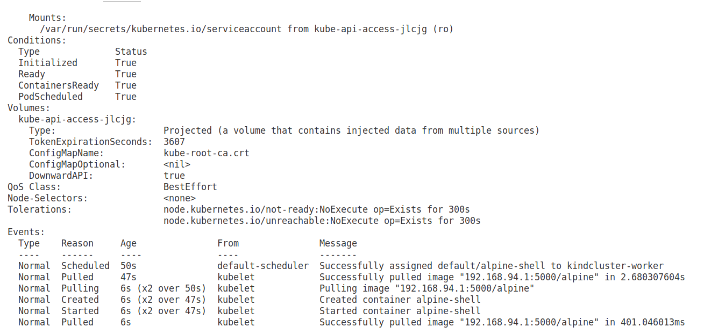

# Terraform-kind

* uso

```
terraform init
```

Edite el archivo variable.tf y ajuste las variables que ud desee. Si va usar un registry mirrors docker declare la ip y el puerto o el fqdns. Ej: `192.168.1.10:5000` o `docker.midominio.cu`

Si no va a usar un registry mirror comente en cluster_kind.tf la session

```
    containerd_config_patches = [
            <<-TOML
             [plugins."io.containerd.grpc.v1.cri".registry.mirrors."${var.registry_mirrors}"]
                endpoint = ["http://${var.registry_mirrors}"]
             [plugins."io.containerd.grpc.v1.cri".registry.configs."${var.registry_mirrors}".tls]
                insecure_skip_verify = ${var.insecure_skip_verify}
            TOML
        ]
```

## Correr el kind

```
terraform plan
terraform apply
```

Una vez ejecutado tendrá el siguiente mensaje:


* Comprobar cluster

```
kubectl cluster-info
```


## Eliminar cluster

```
terraform destroy
```

## desplegar un pods de alpine

```
kubectl run  --image=192.168.94.1:5000/alpine -it alpine-shell -- /bin/ash
```

Ver describe del pods

```
kubectl describe pods alpine-shell
```


